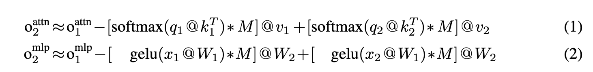
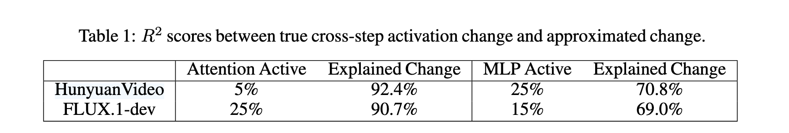

In my very first post here in my personal blog, I'd like to give a fully walk through of the [Chipmunk: Training-Free Acceleration of Diffusion Transformers with Dynamic Column-Sparse Deltas](https://arxiv.org/abs/2506.03275) paper. This paper utilize the well-known property of the diffusion models when generating images and videos, that is, the adjacent steps in the diffusion process are somewhat correlated. Authors use this property to accelerate the inference of diffusion transformers by using a sparse matrix to calculate the delta between the adjacent steps. Futhermore, they also implement the kernel for their algorithm to make it more efficient and performant. The results shows very promising results, for example, it can accelerate the inference of FLUX.1-dev by ~1.6x when generating 1280x768 images in 50 steps.

Although authors from Sandy Research in UCSD already wrote [a series of blog posts](https://sandyresearch.github.io/) and also had a [youtube video](https://youtu.be/Rg9enIRSXmo?si=aB7ZcoG5xfuTlip8) to introduce the algorithm, I still want to write this post to give a fully walk through of the algorithm and the codebase to help myself learning by rewriting in my own words.

In this post, I'll start with the algorithm and paper itself first, and then jump into the codebase that [open-sourced by the authors](https://github.com/sandyresearch/chipmunk). I'll also provide steps that I reproduce the results by the codebase in the end. If you are not interested in the technical details, and just want to adopt the algorithm to your own projects, you can skip to the [Running Chipmunk on diffusion models directly](#running-chipmunk-on-diffusion-models-directly) section. Without further ado, let's get started!

## Introduction

<!---Diffusion model explosion in image/video generation-->
Starting from the very first appearance of the diffusion models that used to genearte images from noise in orign paper [Denoising Diffusion Probabilistic Models](https://arxiv.org/abs/2006.11239), the diffusion models have been widely used in the field of image/video generation. Both architetures and algorithms have been evolving from then on. For the architectures, original paper uses a U-Net to denoise in the pixel space until the intro of [LDM](https://arxiv.org/abs/2112.10752) which uses an autoencoder to embed the image into the latent space. The U-Net is then replaced by a [transformer-based architecture called DiT](https://arxiv.org/abs/2212.09748) in the later works for higher performance, i.e. lower FID score. From the algorithm side, a lot of methods have been proposed to either improve the performance of the diffusion process or to accelerate the inference of the diffusion process. The forward process remains stochastic to model noise corruption, but the reverse process has evolved from stochastic sampling (SDE) to [deterministic trajectories (ODE) in DDIM](https://arxiv.org/abs/2010.02502), and even direct [flow-based mappings in recent works](https://arxiv.org/abs/2210.02747). Most of the newest generative models including [FLUX.1 Kontext](https://arxiv.org/abs/2506.15742) for image geneneration, [MovieGen](https://arxiv.org/abs/2410.13720) and [Wan2.1](https://arxiv.org/abs/2503.20314) are all flow-matching DiTs.

<!---Computation cost and efficiency-->
Even though the generation quality of the diffusion models have been improving tremendously, the computation cost is still a huge problem. The biggest bottlneck is the iterative reverse diffusion process, and tons of research has been proposed to make it faster. Personally, I like to classify the trending methods into two large categories by referring to [Efficient Diffusion Models: A Survey](https://arxiv.org/abs/2502.06805). First, algorithm-level methods, where people try to reduce the number of steps or make each step cost cheaper. Efficient sampling tricks like faster ODE/SDE solver, distillate the multiple steps into less steps, compress the model parameters by quantization and pruning are all belong to this category. The second category is system-level methods that try to control the **data flow** of the inference without changing any model intrinsics. This category mainly includes GPU kernel optimization for operations, more parallelization between GPUs, asynchronous data loading inside GPUs, and a special **cache mechanism** to store the intermediate results and reuse them later.

This is where *Chipmunk* comes in. It’s a system-level method that takes advantage of the **“cache-able”** nature of diffusion models that the adjacent steps are somewhat correlated, use sparse matrix to calculate the delta between the adjacent steps. They even push it further with custom GPU kernels with block size tuning for better performance, and asynchronous data movement in GPU memory for bettern efficiency.

## Background Motivation

Authors first investigate the well-known property of adjacent steps in the diffusion process are somewhat correlated. They first quantify the cross-step activation change of the output for MLP and attention layers that they can use fine-grained sparsity to calculate the delta between the adjacent steps. They defined a mask matrix $M$ to represent the largest cross step activation change as following formula:

And use $R^2$ score to measure the impact of the mask matrix $M$ on the changes, the results are show in the table below:

This evidence shows that when using only small percentage of the elements in the mask matrix $M$, the $R^2$ score is still very high, which means masking current step's computation and only recompute the needed part can still keep the performance of the model. More precisely, we can directly use previous output $o_1$ to get the small change part fixed, and recompute only the needed columns of $k^{T}$ for attention or $W_{1}$ for MLP and corresponding rows of $v$ for the attention or $W_{2}$ for MLP.

## Chipmunk algorithm

## Chipmunk algorithm

## Experiments

## Conclusion

## Open questions
- Where's the analysis of "acorss token", and "across layers"? What's the M they used for initial analysis?